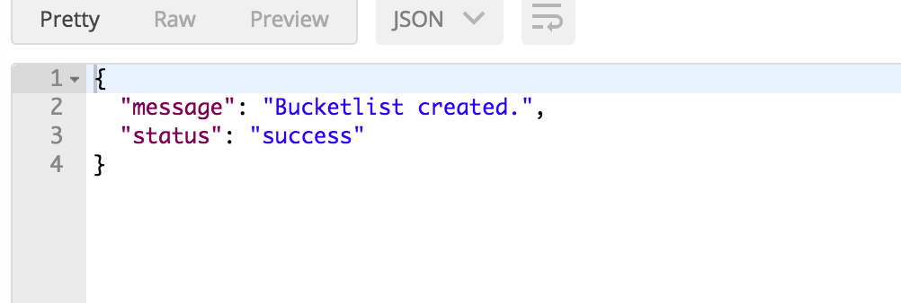
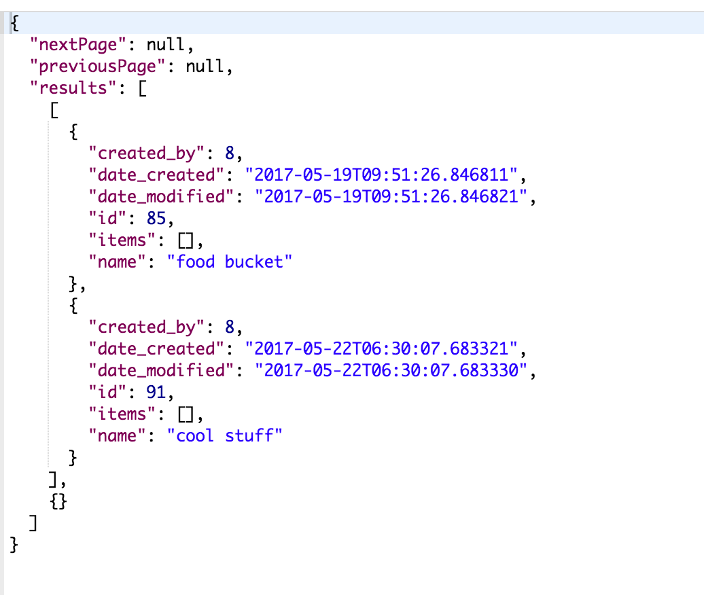
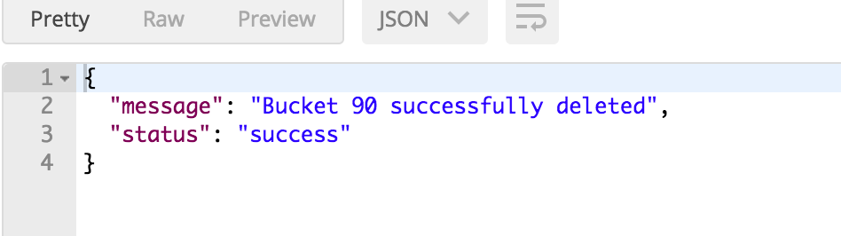

# Bucketlist API 

## Introduction
This is an API that allows you acts as a resource for your Bucketlist application.

## Installation
* clone repository

 `git@github.com:NgangaMaryanne/Bucketlist.git`

* Install virtual environment wrapper

* make virtual environment

 `mkvirtualenv Bucket`

* Install requirements 

 `pip install -r requirements.txt`

* Run
 
 `python run.py`

* Initialize API testing software. Recommended is Postman.
* Send requests to the API endpoints as below.

|           |          |                                                                                                                                                                                |
|-----------|---------|---------------------------------------------------------------------------------------------------------------------------------------------------------------------------------| 
| Endpoint  | Methods |  Data required                                                                                                                                                                    | 
| `auth/register `  | POST  | `{"email":"this user email", "username":"this user username": "first_name":"this user firstname", "last_name": "this user last name", "password":"this user password"}` | 
| `auth/login` | POST | `{"email":"this user email","password":"this user password"}`                                                                                                                 | 
| `/api/v1/bucketlists` |  GET                                                                                                                                                                              |                                                                                                                                                                        |
| `/api/v1/bucketlists`                                     | POST    | `{"name": "this bucketlist name"} `                                                                                                 |
| `/api/v1/bucketlists/<int:bucket_id> `                    | PUT     | `{"name": "updated bucketlist name"}`                                                                                               |
| `/api/v1/bucketlists/<int:bucket_id> `                    | DELETE  |                                                                                                                                   |
| `/api/v1/bucketlists/<int:bucket_id>/items`               | POST    | `{"name": "item name"}`                                                                                                              |
| `/api/v1/bucketlists/<int:bucket_id>/items/<int:item_id>` | PUT     | `{"name ": "new item name", "done": "'false'/'true'"} `                                                                              |
| `/api/v1/bucketlists/<int:bucket_id>/items/<int:item_id>` | DELETE  |                                                                                                                                       |

## sample responses
* Bucketlist Post:

* Bucketlist Get:

 
* Bucketlist delete:

